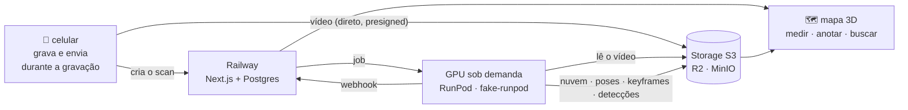

# Logikos Twins

Reconstrução 3D a partir de vídeo de celular: grava-se um ambiente andando, e minutos
depois há um mapa 3D navegável daquele lugar — nuvem de pontos densa, trajetória da
câmera, medição com escala real, anotações e **detecções ancoradas em coordenadas 3D**
(cruzando a reconstrução com um detector de objetos, plugável).

Pipeline: captura no navegador → upload direto ao storage (presigned, nunca passa pelo
servidor web) → job de reconstrução numa GPU sob demanda (scale-to-zero) → viewer Three.js
com medição, anotações e busca semântica sobre as detecções.

---

## Rodar em 5 comandos

Sem conta, sem chave, sem cartão. O ambiente inteiro sobe local.

```bash
git clone https://github.com/logikos33/Logikos-Twins-.git
cd Logikos-Twins-
cp .env.example .env
make install
make dev
```

| O quê | Onde |
|---|---|
| Aplicação | http://localhost:3000 |
| Healthcheck | http://localhost:3000/api/health |
| Console do MinIO (papel do R2) | http://localhost:9001 — `twins-dev` / `twins-dev-secret` |
| Sósia do RunPod | http://localhost:8080/health |

> **Testar a câmera no celular:** `getUserMedia` só funciona em contexto seguro. `localhost`
> serve; pela rede local é preciso HTTPS — use `mkcert` ou um túnel. Ver
> [`docs/protocolo-captura.md`](./docs/protocolo-captura.md).

O que a demo faz, de ponta a ponta: gravação na página com envio durante a captura →
reconstrução 3D → viewer com medição (calibração manual **ou automática por marcador
ArUco** — PDF em `/api/marker`), pins com foto-evidência, planta baixa com corte,
**busca semântica** ("onde está a mesa?") que voa a câmera até o objeto, blur de rostos
opcional (LGPD), retenção automática do vídeo bruto e painel `/admin?token=…` com custos.

---

## Como funciona



Duas propriedades sustentam o custo: **a mídia nunca passa pelo servidor web** (vai direto
ao bucket, nos dois sentidos) e **a GPU só existe enquanto processa** (scale-to-zero, custo
zero entre scans).

Detalhe completo em [`docs/architecture.md`](./docs/architecture.md).

---

## Desenvolvimento sem GPU e sem credenciais

Esta é a decisão de engenharia que define o projeto: **tudo é desenvolvido e testado
localmente**, e a FASE PLUG-IN é troca de variáveis de ambiente — não refatoração.

| Produção | Desenvolvimento | Como |
|---|---|---|
| Cloudflare R2 | **MinIO** | R2 é S3-compatível; o mesmo SDK, o mesmo presign ([ADR-0003](./docs/adr/0003-storage-adapter-s3.md)) |
| RunPod Serverless | **fake-runpod** | Sósia que implementa o contrato de verdade — fila, cold start, webhook com retry ([ADR-0004](./docs/adr/0004-fake-runpod-sosia-de-contrato.md)) |
| GPU + pesos de 4,6 GB | **cena sintética** | Sala de dimensões conhecidas por construção — o que permite testar medição e desprojeção com número esperado, não com "apareceu um arquivo" |

```bash
make dev          # ambiente completo
make check        # os mesmos gates que a CI roda
make fixture      # (re)gera a cena sintética
make reset        # zera banco e storage
make help         # todos os comandos
```

---

## Estrutura

```
apps/web/      Next.js (App Router) + TS strict + Prisma · páginas, API e viewer Three.js
worker/        Python · LingBot-Map + pós-processamento + detector (roda na GPU e em CPU)
fake-runpod/   Sósia do RunPod. Desenvolvimento apenas
scripts/       Cena sintética, gates, infraestrutura como código
docs/          architecture.md · adr/ · specs/ · protocolo-captura.md
referencias/   NÃO VERSIONADO — discussões, pesquisas, apresentações
```

---

## Como se trabalha aqui

Spec antes de código; ADR antes de "porque sim". Não é burocracia — é o que evita
retrabalho quando outra pessoa (ou outro agente) pega o projeto três semanas depois.

- **[`CLAUDE.md`](./CLAUDE.md)** — contexto permanente e as armadilhas conhecidas. Leia primeiro.
- **[`docs/specs/`](./docs/specs/)** — uma spec por etapa, com critérios de aceite verificáveis.
- **[`docs/adr/`](./docs/adr/)** — as decisões e o que se sabia na hora. Imutáveis.
- **[`STATUS.md`](./STATUS.md)** — onde estamos e como testar agora.
- **[`DECISIONS.md`](./DECISIONS.md)** — divergências entre plano e realidade. A realidade vence.

Gates bloqueantes na CI: lint, tipos, testes, build, **licença** (nada de AGPL no caminho
servido), **vulnerabilidades** (exceções explícitas e com prazo) e **segredos**
(`gitleaks` no histórico completo — repositório público, todo push é visível na hora).

---

## Licenças

Permitido Apache-2.0, MIT, BSD-3. **Proibido AGPL e copyleft forte** — o que bane o stack
ultralytics e é o motivo de o detector base ser o **YOLOX**. A regra é verificada por
`scripts/license_gate.py` na CI. Inventário em [`LICENSES.md`](./LICENSES.md).

Motor de reconstrução: [LingBot-Map](https://github.com/Robbyant/lingbot-map)
(Robbyant/Ant Group, Apache-2.0).
