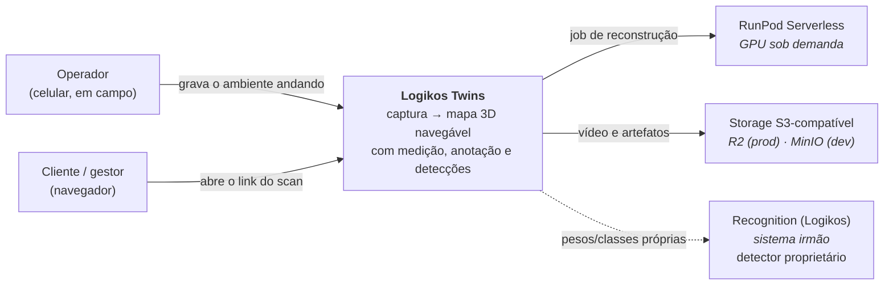
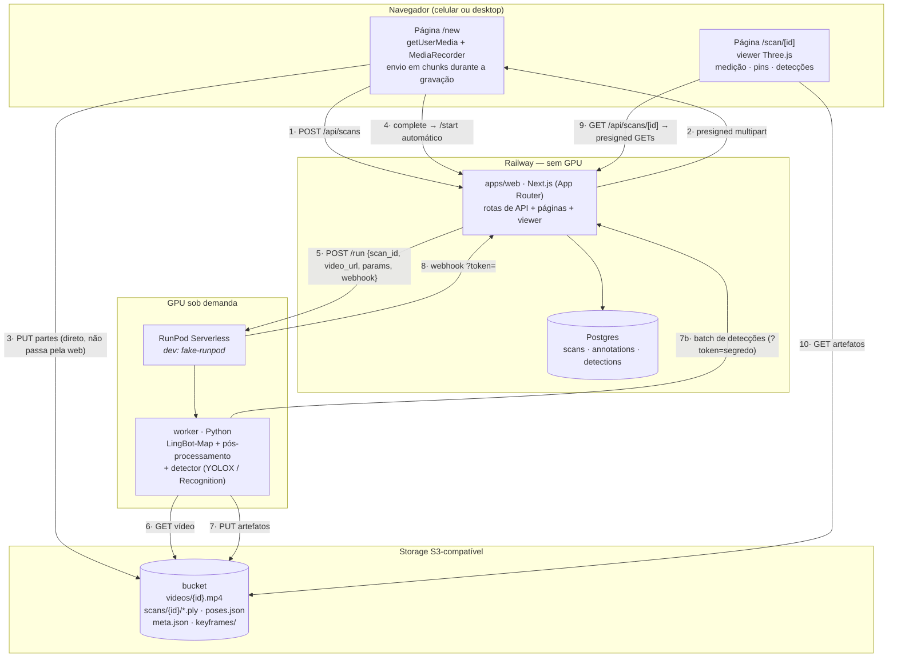
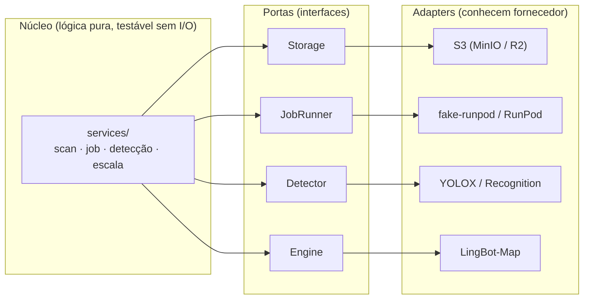
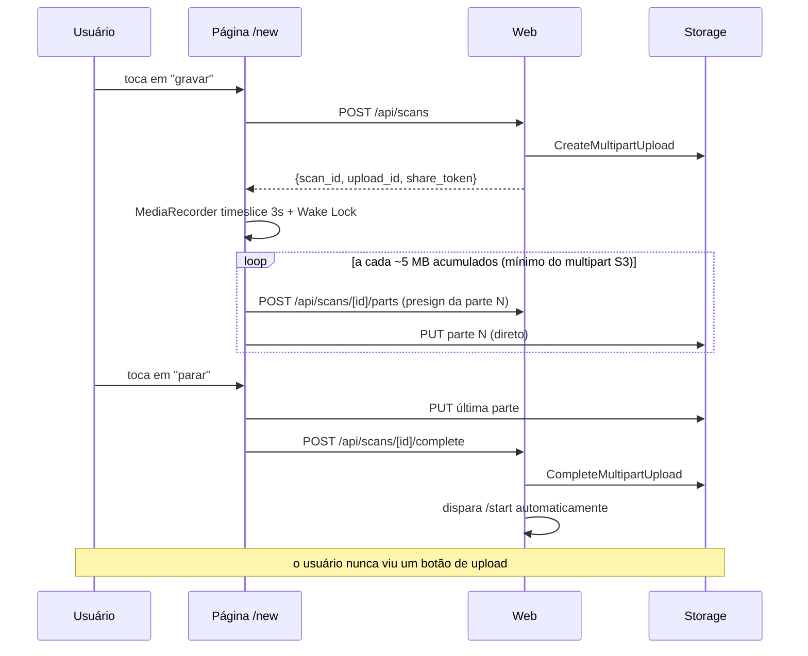
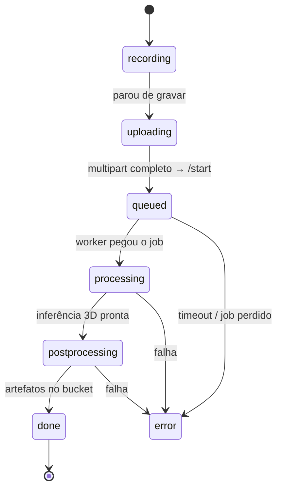
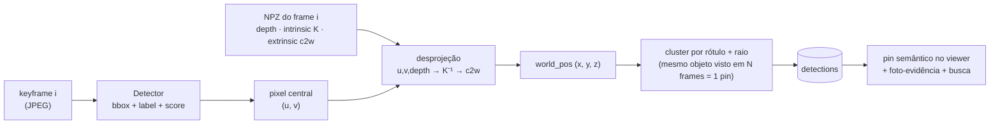

# Arquitetura — Logikos Twins

> **Regra:** este documento é parte do código. Diagrama desatualizado é tratado como bug e
> corrigido **no mesmo commit** que muda a arquitetura.

---

## C4 nível 1 — Contexto

O produto responde a uma pergunta que nenhuma planta baixa responde: **"onde está isso, no
espaço real?"** — filmando com um celular comum, sem hardware proprietário.

---

## C4 nível 2 — Contêineres

### Por que assim

- **Mídia nunca trafega pela web.** O vídeo vai do celular direto ao bucket por presigned
  URL, e os artefatos voltam do worker direto ao bucket. O Railway move JSON, não gigabytes —
  é o que mantém o custo em dezenas de dólares por mês em vez de centenas.
- **A GPU só existe enquanto processa.** Scale-to-zero: entre um scan e outro, o custo de GPU
  é exatamente zero.
- **O webhook não é a única forma de saber que terminou.** Há reconciliação por polling para
  jobs presos — webhook é otimização, não fonte de verdade.

---

## Regra de dependência (arquitetura hexagonal nos pontos de troca)

**Invariantes, verificadas em revisão:**

1. `apps/web` **nunca** importa de `worker/`. Eles conversam só pelos contratos da §4 do plano.
2. Nenhum módulo fora de um adapter menciona MinIO, R2, RunPod, YOLOX ou LingBot-Map pelo nome.
3. A rota HTTP valida a borda (Zod) e delega. Rota não fala com Prisma nem com storage.
4. O núcleo não faz I/O — é o que permite testar desprojeção, escala e conversão sem subir nada.

É essa disciplina que faz a FASE PLUG-IN ser troca de variáveis de ambiente em vez de
refatoração. Ver ADR-0003 (Storage), ADR-0004 (JobRunner), ADR-0005 (Detector).

---

## Fluxos principais

### Captura (D1) — sem botão de upload

### Processamento (D2/D3)

O estado avança por **webhook** (rápido) ou por **reconciliação em polling** (rede de
segurança, a cada 60 s para jobs parados). Os dois caminhos convergem no mesmo serviço —
não há lógica de transição duplicada.

### Detecção ancorada (D5) — o diferencial

É aqui que "nuvem de pontos bonita" vira **mapa que responde perguntas**.

Os clusters vão do worker à API pela rota batch (autenticada pelo mesmo segredo do
webhook) e vivem na tabela `detections`; a escala automática por ArUco (D6) viaja no
retorno do job e sobrescreve a calibração manual quando o marcador foi visto.

---

## Ambientes

| | Desenvolvimento | Produção (FASE PLUG-IN) |
|---|---|---|
| Web | `next dev` no compose | Railway, região `us-east4` |
| Banco | Postgres no compose | Postgres do Railway |
| Storage | **MinIO** (`S3_FORCE_PATH_STYLE=true`) | **Cloudflare R2** (`false`) |
| Job runner | **fake-runpod** (`synthetic` ou `local-worker`) | RunPod Serverless, GPU L4/4090 |
| Detector | YOLOX ONNX em CPU | YOLOX/Recognition em GPU |
| Pesos do motor | não usados (fixture sintética) | network volume, 4,6 GB |

**Os artefatos são os mesmos nos dois ambientes.** A diferença é inteiramente de variáveis de
ambiente — nenhum `if (production)` no código.
